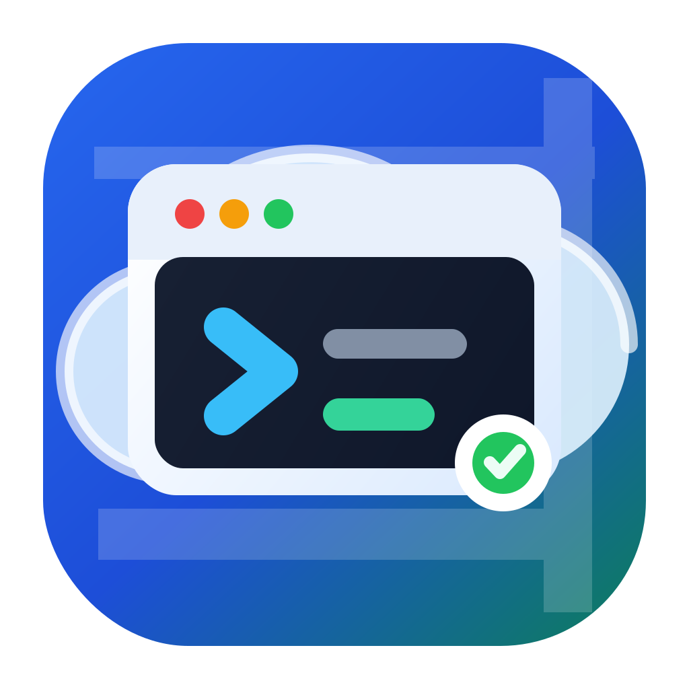

# EasyConsole

<p align="center">
  
</p>

Tauri-first desktop control panel for the existing web console API at `http://116.172.93.164:28080/`, with companion CLI and MCP tools for scripted and AI-assisted operations.

Development priority is the Tauri desktop app and the CLI/MCP sidecars derived from it. The web build remains useful for renderer development, fast debugging, and keeping the UI portable, but product decisions should optimize for the packaged desktop workflow first.

## Current Scope

- Login, saved-token account recovery, and user session expiry handling.
- Dashboard summaries with raw API response panels for field validation.
- Task table with URL/query state, filters, column visibility, auto-refresh, batch actions, clone/create, logs, downloads, monitor links, raw JSON, SSH details, and WebSSH.
- Local instance templates for repeatable/batch task creation.
- Local scheduled tasks for deferred task creation from saved payloads.
- Storage browser with breadcrumbs, mkdir, delete, preview/read, download, upload queue, chunked upload, and 0B file handling.
- Image list across custom/system images, default-image action, commit-from-task, and download.
- Settings for API base URL, monitor dashboard URL, language, and task status notification preferences.
- Run logs for web, Tauri, CLI, and MCP operations with filtering, export, clearing, retention, and sensitive metadata redaction.
- Tauri desktop shell with runtime storage, notifications, external link opening, in-app SSH, system terminal SSH, and VS Code Remote-SSH setup.
- Node CLI and MCP stdio server that reuse the same API wrappers as the React app.
- Browser runtime remains supported as a development and fallback target, but desktop-only capabilities define the primary experience.

## Setup

```powershell
npm.cmd install
Copy-Item .env.example .env.local
npm.cmd run dev
```

PowerShell may block `npm.ps1`; use `npm.cmd` on Windows.

For desktop development:

```powershell
npm.cmd run tauri:dev
```

`dev:tauri` starts only the Tauri-targeted Vite dev server; `tauri:dev` is the normal desktop entrypoint and starts that server through Tauri's `beforeDevCommand`.

## Environment

`VITE_API_BASE_URL` defaults to:

```text
http://116.172.93.164:28080/api
```

`VITE_MONITOR_DASHBOARD_URL` defaults to:

```text
http://116.172.93.164:33000/d/da7c4fef-70c7-43eb-8103-31b7d283ca9f/pod-board?orgId=1
```

The WebSSH URL is derived from the same host:

```text
ws://host/ws/webssh?task_id={id}&cols={cols}&rows={rows}
```

The in-app Settings page can override the API base and monitor dashboard URL locally. Those saved runtime settings take precedence over `.env` defaults for subsequent app requests, monitor links, and WebSSH URL generation.

## AI and CLI Access

EasyConsole also exposes a Node-based CLI and MCP stdio server for AI agents and scripts. These entrypoints reuse the same API wrappers as the React app.

For AI agents that support skills, use the repository skill at:

```text
skills/easy-console-ai/SKILL.md
```

The skill explains when to prefer MCP versus CLI, how to authenticate, which operations are read-only, and how to handle risky mutations with `confirm: true` or `--yes`.

### Local credentials

The CLI reads configuration from `%USERPROFILE%\.easy-console\config.json` by default. Environment variables override the file:

```text
EASY_CONSOLE_API_BASE_URL=http://116.172.93.164:28080/api
EASY_CONSOLE_MONITOR_DASHBOARD_URL=http://116.172.93.164:33000/d/da7c4fef-70c7-43eb-8103-31b7d283ca9f/pod-board?orgId=1
EASY_CONSOLE_TOKEN=Bearer ...
EASY_CONSOLE_CONFIG=D:\path\to\config.json
```

Login stores a normalized bearer token in the local config file:

```powershell
"your-password" | npm.cmd run ec -- login --username your-name --password-stdin
```

Do not commit real credentials or generated config files.

### CLI commands

Use `npm.cmd run ec --` before the command arguments:

```powershell
npm.cmd run ec -- whoami
npm.cmd run ec -- --json task list
npm.cmd run ec -- --json task log 123
npm.cmd run ec -- --json storage ls /
npm.cmd run ec -- --json storage cat /path/to/file.txt
npm.cmd run ec -- --json image list
npm.cmd run ec -- --json resource list
npm.cmd run ec -- --json price list
npm.cmd run ec -- --json monitor-url 123
npm.cmd run ec -- --json run-log list
npm.cmd run ec -- --json run-log export
```

Mutation commands are dry-run by default. Pass `--yes` to execute:

```powershell
npm.cmd run ec -- --json task create --name demo --image-id 1 --cpu 4 --gpu 0 --memory 16
npm.cmd run ec -- --json task create --name demo --image-id 1 --cpu 4 --gpu 0 --memory 16 --yes
npm.cmd run ec -- --json task release 123 --yes
npm.cmd run ec -- --json task delete 123 --yes
npm.cmd run ec -- --json storage mkdir /demo --yes
npm.cmd run ec -- --json storage delete /demo --yes
npm.cmd run ec -- --json image set-default 1 --yes
npm.cmd run ec -- --json run-log clear --yes
```

All `--json` CLI output uses this shape:

```json
{ "ok": true, "data": {}, "error": null }
```

Task logs and remote text reads are truncated by default at `200000` bytes and return truncation metadata.

### MCP server

Start the MCP stdio server with:

```powershell
npm.cmd run ec:mcp
```

Available MCP tools include task list/log/create/release/delete, storage list/read/download/mkdir/delete, image list/set-default, user info, resources, prices, monitor URL generation, and local run-log list/export/clear. Mutating MCP tools require `confirm: true`; otherwise they return a dry-run payload.

## Desktop Runtime

The desktop app is built with Tauri 2 and is the primary product target. Web code talks to `src/lib/runtime.ts`; Tauri-specific commands live in `src-tauri/src/lib.rs`.

- Storage settings and saved tokens are persisted in the Tauri app data directory and fall back to browser storage if a command fails.
- HTTP and WebSocket calls use Tauri plugins in desktop and browser APIs on the web.
- System notifications use the Tauri notification plugin on desktop and the browser Notification API on the web.
- Desktop task SSH actions include in-app SSH auto-login, opening a system terminal, and configuring/opening VS Code Remote-SSH. Web runtime only exposes copyable SSH details and WebSSH.
- VS Code Remote-SSH setup creates an EasyConsole-managed key, installs the public key on the target host through password SSH, and writes an EasyConsole-marked block in the user's SSH config.
- New platform behavior should be designed for Tauri first, then exposed through the browser runtime only when it has a clean equivalent.

## Packaging

Desktop packaging produces the GUI app plus two AI/script sidecar executables:

```text
EasyConsole / EasyConsole.exe
easy-console-cli / easy-console-cli.exe
easy-console-mcp / easy-console-mcp.exe
```

The sidecars are built from `tools/easy-console/` and copied into `src-tauri/binaries/` using Tauri's target-triple naming convention before the desktop bundle is created. The CLI sidecar is packaged as `easy-console-cli` so it does not collide with the Cargo package name `easy-console`.

On Windows PowerShell, use `npm.cmd`. On macOS/Linux shells, use `npm`.

Build the sidecars only:

```powershell
npm.cmd run build:sidecars
```

Build desktop inputs without creating an installer:

```powershell
npm.cmd run build:desktop
```

The generated standalone tools are written to:

```text
build/sidecars/easy-console-cli[.exe]
build/sidecars/easy-console-mcp[.exe]
```

The Tauri-ready sidecar binaries are written to:

```text
src-tauri/binaries/easy-console-cli-{target-triple}[.exe]
src-tauri/binaries/easy-console-mcp-{target-triple}[.exe]
```

Examples include `x86_64-pc-windows-msvc.exe`, `aarch64-apple-darwin`, and `x86_64-unknown-linux-gnu`.

Build the full desktop package:

```powershell
npm.cmd run tauri:build
```

`tauri:build` runs Tauri, and Tauri's `beforeBuildCommand` runs:

```powershell
node tools/easy-console/build-desktop.mjs
```

That command builds both sidecars and the web app before bundling. The build command uses Tauri hook environment variables such as `TAURI_ENV_TARGET_TRIPLE`, `TAURI_ENV_PLATFORM`, and `TAURI_ENV_ARCH` when present, so sidecars are named correctly for explicit targets such as `--target x86_64-apple-darwin`.

The final installers and desktop binaries are under:

```text
src-tauri/target/**/release/EasyConsole*
src-tauri/target/**/release/bundle/
```

Installers and app bundles include both sidecars. For portable/manual distribution, keep the main desktop binary together with the matching files under `build/sidecars/`.

Current sidecar packaging supports Windows, macOS, and Linux on x64 and arm64. The sidecars are generated artifacts and are ignored by git.

## CI/CD

GitHub Actions workflows live in `.github/workflows/`:

- `ci.yml`: runs on pull requests and pushes to `main`/`master`; verifies Windows, macOS, and Linux with typecheck, tool typecheck, lint, tests, desktop input build, Tauri shell check, and sidecar artifact upload.
- `release.yml`: runs on `v*` tags or manual dispatch; verifies the project, builds Windows, macOS, and Linux Tauri desktop bundles, creates a draft GitHub release, and uploads sidecar plus desktop artifacts.

Create a release by pushing a version tag:

```powershell
git tag v0.1.0
git push origin v0.1.0
```

## Verification

Run these before shipping:

```powershell
npm.cmd run typecheck
npm.cmd run typecheck:tools
npm.cmd run lint
npm.cmd run test
npm.cmd run build:web
npm.cmd run build:desktop
cargo check --manifest-path src-tauri/Cargo.toml
```

Live verification still needs a real test account. Validate exact request and response fields for task creation, storage upload completion, and image actions before marking those flows complete.
